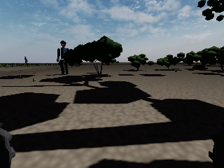

# Agriculture

Crop-row missions in a simulated cotton farm: SLAM, Nav2, lighting and active suspension.

| The VIGIL rover (CAD preview) | View from the rover in the cotton farm |
|---|---|
|  |  |

*A dashboard screenshot for this environment has not been captured yet. Add it to `Images/Dashboards/`.*

| What | Where |
|---|---|
| ROS 2 packages (`agri_ugv`, `agri_ugv_description`, `agri_ugv_setup`) | [`src/`](src) |
| Start / stop scripts | [`run.sh`](run.sh), [`stop.sh`](stop.sh), [`demo.sh`](demo.sh) |
| Documentation | [`README.md`](README.md), [`AGRI_DASHBOARD.md`](AGRI_DASHBOARD.md), [`ACCEPTANCE.md`](ACCEPTANCE.md), [`CAD_UPDATE.md`](CAD_UPDATE.md) |
| Environment images | [`Images/`](Images) |
| Recorded results (JSON and PNG) | [`reports/`](reports) |
| Tests and tools | [`tests/`](tests), [`tools/`](tools) |
| Overview, setup and evidence | [`../docs/`](../docs) |

Run: `./run.sh` from this folder (`ROS_DOMAIN_ID=91`), or VIGIL launcher option 2.
