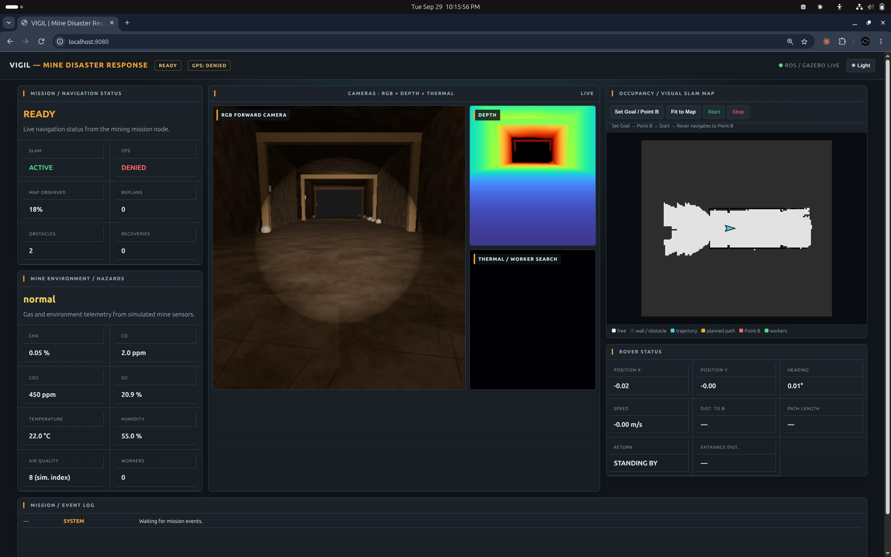

| Environment | Dashboard |
|---|---|
|  |  |

# Mining application — terrain inspection and navigation

[Project overview](../README.md) · [Architecture](../docs/architecture.md) · [Validation](../docs/validation.md)

## Scope and implementation status

Mining is an intended application of the VIGIL rough-terrain rover: remotely observing an outdoor mine-site route and studying navigation over uneven ground, around rocks and near drops. This application maps to the existing depth-perception and navigation work in `Rock Terrain/`.

**The repository currently contains a generic rocky-terrain simulation, not a separately implemented or validated mining environment.** This page describes the proposed application and the existing components that could support it. No dedicated mining package, mining dashboard, mine-site trial or underground mission was found in the inspected source. The existing camera captures remain labelled as rough-terrain captures.

## Proposed mission objectives

- Inspect a selected outdoor access route using the onboard camera view.
- Estimate traversability from depth observations of surface geometry.
- Identify geometric hazards such as obstacles, steep terrain and drop-offs along the route.
- Plan toward an operator-selected observation point while accounting for the rover footprint.
- Present terrain classes, route changes and mission state to an operator.

These objectives concern navigation and visual inspection. Mineral identification, excavation, gas monitoring and structural-stability assessment are not implemented capabilities of this repository.

## Existing components and mining relevance

| Function | Available foundation | Mining-specific work still required |
|---|---|---|
| Scene observation | Simulated RGB-D camera and live overlay | Validate camera visibility and depth quality in representative site conditions |
| Terrain interpretation | Geometric slope, roughness, step and drop classification | Evaluate site-relevant surfaces and hazard-detection errors |
| Route planning | Footprint-aware A* and terrain costs | Add a mine-site world, permitted routes and exclusion areas |
| Rover mobility | Eight-wheel model, articulated rockers and simulated suspension | Validate traction, contact and mechanical limits for the intended terrain |
| Operator monitoring | Live camera, map, goal and navigation state | Define inspection reports and intervention procedures |
| Localization | Simulator ground-truth pose in the current rough-terrain controller | Integrate and validate visual/visual-inertial localization before claiming GPS-denied mine-site autonomy |

See [the actual source interfaces](../docs/architecture.md#rough-terrain-pipeline). No new sensing or mission software is introduced by this documentation addition.

## Proposed operating process

1. **Define the inspection route:** specify start, observation goal and areas the rover must avoid in a representative mine-site simulation.
2. **Check inputs:** confirm camera, depth, pose and controller health before enabling motion.
3. **Observe terrain:** build the local terrain representation from incoming depth observations.
4. **Plan and navigate:** select a route that respects geometry, footprint and configured costs.
5. **Monitor changes:** show newly observed hazards and route changes to the operator.
6. **Handle uncertainty:** develop and test bounded recovery and a safe-stop response for missing observations, blocked routes and localization failure.
7. **Record the inspection:** save camera evidence, trajectory, interventions and completion status.

Steps involving a dedicated mine-site world, exclusion areas, input-health gating, bounded recovery and inspection reporting are proposed integration work, not a claim that the current launcher implements a complete mining mission.

## Demonstration available today

Run the [rough-terrain demonstration](../docs/setup.md#recommended-first-demonstration-rough-terrain) to inspect the existing camera → terrain map → planner → wheel-control flow. The cliff scenario illustrates geometric drop detection. Both are generic simulation demonstrations; neither is evidence of a mining deployment.

The [live capture record](../docs/validation.md) reports one short goal-reaching run using simulator position. It contains no mining-specific performance measurements.

## Validation needed before claiming a mining demonstration

- Build a representative outdoor mine-site scenario with documented routes and hazards.
- Replace simulator pose in the mission loop with an evaluated sensor-derived estimate.
- Test obstacle/drop detection, route completion, collisions and interventions over repeated runs.
- Evaluate reduced visibility, difficult visual texture, varying illumination and invalid depth observations.
- Test blocked routes and loss of sensing/localization, including stop and operator recovery.
- Record results against a fixed scenario, source version and mission configuration.

Underground navigation would require a separate scenario and validation effort. No underground readiness is claimed here.
