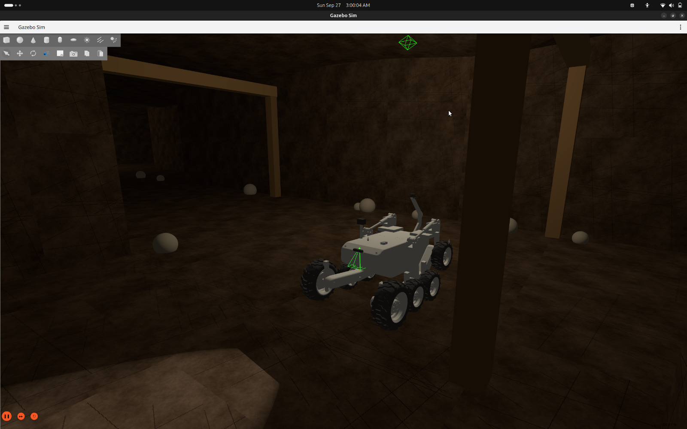

# Existing Mining

This is the earlier mining project, which the VIGIL launcher lists as option 4 (package `vigil_mining`,
`ROS_DOMAIN_ID=73`).

**Its workspace is not currently in this repository.** The launcher looks for it in a local `mining/`
folder next to `vigil/`, and this folder is where it is looked for after cloning. To add it, place the
workspace here so that `src/vigil_mining/launch/mining.launch.py` exists.

The picture above is a Gazebo capture of the rover in this environment. No dashboard capture is in the repository yet.
The rough-terrain captures are not mining results and are deliberately not used here.

What the repository does say about mining:
- [`../docs/mining.md`](../docs/mining.md): the proposed mining application and what is still to be validated.
- [`../docs/validation.md`](../docs/validation.md): the "Mining evidence status" section.
- [`../New Mining/`](../New%20Mining): the newer, independent mining environment.
