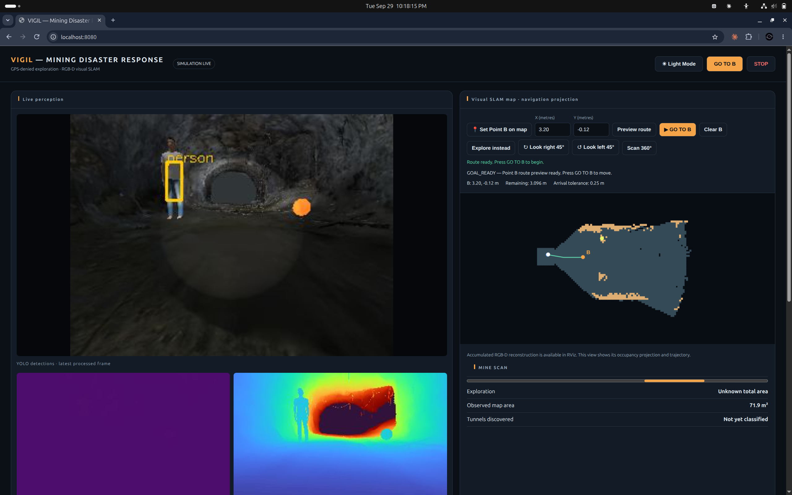

| Environment | Dashboard |
|---|---|
|  |  |

# VIGIL New Mining

Independent ROS 2 Jazzy and Gazebo Harmonic workspace for GPS-denied mining
disaster response. It uses the VIGIL eight-wheel rover physics with a dedicated
textured underground world, RGB-D visual SLAM, wheel/IMU fusion, environmental
sensors, thermal imaging, YOLO/OpenCV perception and a localhost dashboard.

The dashboard at `http://localhost:8080` supports autonomous exploration and
operator-selected Point B navigation. A user can click a known free point on the
visual SLAM map or enter map-frame X/Y coordinates, preview the route, and then
press **GO TO B**. The goal planner uses obstacle-clearance-aware A* and the
controller uses regulated pure pursuit with curvature speed control, forward
collision prediction and a 0.25 m confirmed-arrival tolerance.

## Setup

1. Install ROS 2 Jazzy, Gazebo Harmonic, RTAB-Map, `robot_localization`, OpenCV
   and `gz_ros2_control`.
2. Add the licensed mine files described in
   [`models/mine/README.md`](src/vigil_new_mining/models/mine/README.md).
3. Obtain the official `yolov3-tiny.weights` file and place it in
   `src/vigil_new_mining/config/`. The system continues with YOLO marked
   unavailable when the optional weights are absent.
4. Build and run:

```bash
cd "New Mining"
source /opt/ros/jazzy/setup.bash
colcon build --symlink-install
./run.sh
```

The workspace is separate from the pre-existing Mining project. From the VIGIL
launcher, option 4 remains Existing Mining and option 5 launches this workspace.

## Current validation scope

The package builds and has produced live Gazebo RGB/depth/thermal streams,
eight-wheel encoder feedback, RGB-D odometry, RTAB-Map updates and environmental
sensor values. Navigation-core unit tests cover goal validation, obstacle and gas
hazard exclusion, route blockage, path tracking, braking and predicted-arc
collision rejection. Broader repeated end-to-end mine missions remain future
validation work.
