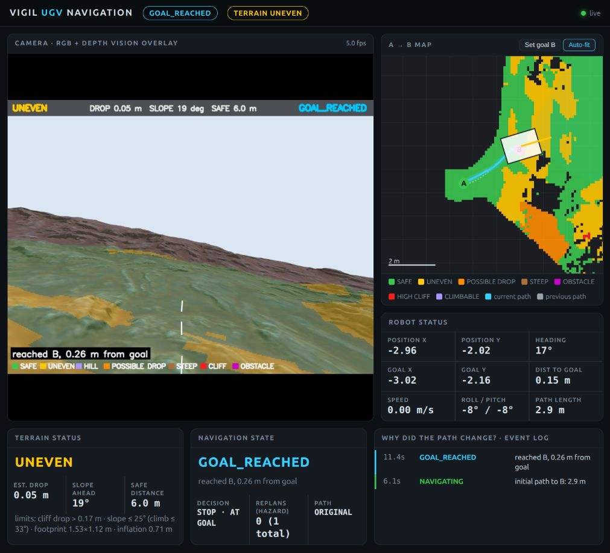
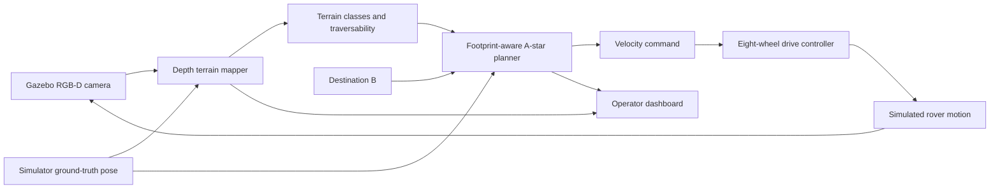
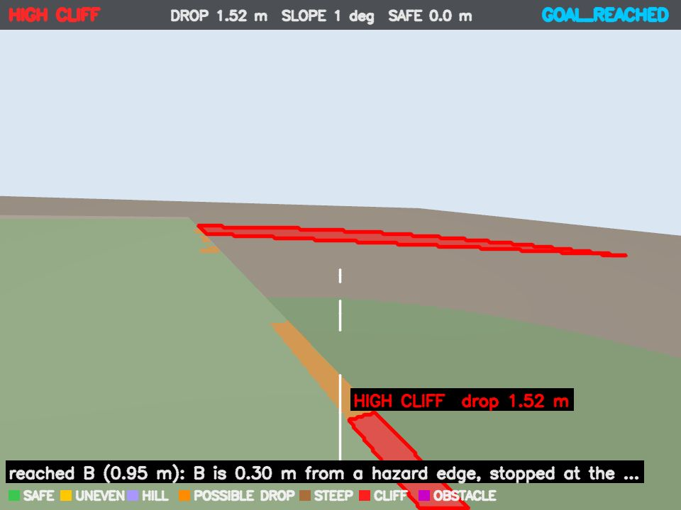
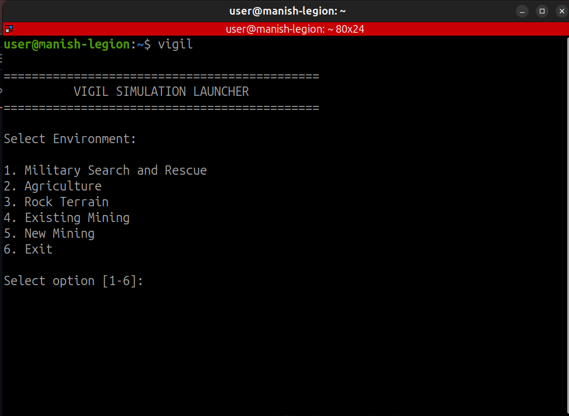

# VIGIL — Vision-Based Outdoor UGV Navigation

**Vision-Integrated Ground Intelligence and Localization**
**Smart India Hackathon 2026 · SIH26126 · ROS 2 Jazzy · Gazebo Harmonic**

VIGIL explores how an eight-wheel unmanned ground vehicle can interpret terrain, plan a route and drive toward a destination. The project combines simulated cameras, terrain perception, planning, wheel control and operator dashboards across rough-terrain, agriculture, search-and-rescue and a new underground mining environment.

**Current stage: simulation prototype.** Depth-based navigation is implemented.

[Capabilities and innovation](docs/capabilities-and-innovation.md) · [Architecture](docs/architecture.md) · [How it works](docs/navigation-workflow.md) · [Run a demo](docs/setup.md) · [Evidence and limitations](docs/validation.md) · [Detailed operations](docs/operations.md) · [Maintainer guide](docs/maintaining.md)

[New Mining environment and dashboard](docs/new-mining.md)

## See the system



*Captured from a live run on 27 September 2026: the rough-terrain navigator reported `GOAL_REACHED`. Camera data comes from Gazebo; position comes from `/sim/ground_truth`. This single run is not a general collision-avoidance benchmark. [Capture details and raw status](docs/validation.md).*

### Demonstration video

[Watch the VIGIL demonstration][demo-video]

[][demo-video]

The video presents the VIGIL concept and its simulation work. Simulation captures and run details are also available in the [evidence gallery](docs/validation.md).

[demo-video]: https://youtu.be/WZutmP8n8Oc?si=ThVBvrjVecI3OAJ3

## Repository Layout

```text
vigil-multi-purpose-ugv/
├── README.md                    Project overview and video link
├── STRUCTURE.md                 Which folder holds which environment
├── docs/                        Architecture, workflow, setup and evidence
│   ├── media/                   Simulation captures
│   └── validation/              Captured machine-readable status
├── vigil/                       Launcher menu for the five environments
├── Military Search and Rescue/  SAR world, assets and ROS workspace
├── Agriculture/                 Agriculture ROS workspace
├── Rock Terrain/                Rough-terrain ROS workspace
├── Existing Mining/             Existing mining application notes and captures
└── New Mining/                  Underground mine ROS workspace
```

Each environment folder has its own `README.md`. Build outputs, installation folders and logs remain excluded from version control.

## The problem we address

SIH26126 concerns vision-based autonomous navigation for an outdoor UGV in GPS-denied conditions. The central engineering tasks are finding traversable ground, estimating position from visual observations, and avoiding obstacles while reaching a destination.

| Requirement | What exists in this repository | Remaining evidence or work |
|---|---|---|
| Detect paths and hazards | Depth-based terrain classification; agricultural geometry and vegetation processing | Benchmark detection accuracy under varied outdoor conditions |
| Visual localization without GPS | Agriculture includes wheel/IMU odometry and RTAB-Map mapping | Validate visual localization in the actual mission control loop; replace ground-truth pose dependencies |
| Plan and avoid collisions | Footprint-aware A* in rough terrain/SAR; Nav2 and a separate crop-row controller in agriculture | Controlled obstacle-avoidance trials, especially moving obstacles and headland turns |
| Autonomous A-to-B operation | A live short rough-terrain run was observed reaching its goal | Repeated trials, collision instrumentation and broader scenarios |

The present depth-processing pipeline uses geometric rules. It should not be described as a trained perception AI model without a corresponding model and evaluation.

## Capability and innovation summary

| Category | Current position |
|---|---|
| **Implemented in software** | Eight-wheel rover simulation; RGB-D, LiDAR, IMU and wheel interfaces; depth-based terrain classification; footprint-aware A*; motion control; mapping/localization components; mission dashboards; crop-row and SAR mission software |
| **Demonstrated in simulation** | Short rough-terrain A-to-B navigation; live terrain overlay; cliff detection; route updates; agricultural drive/return, lighting and suspension checks; SAR motion and simulated thermal-human processing |

The main technical innovation is the connection between **camera-derived terrain geometry, the rover's physical dimensions and autonomous planning**. Instead of treating the environment as a flat free/occupied grid or treating the rover as a point, VIGIL evaluates slope, roughness, steps and drops against the rover footprint, wheel size, clearance and climbing limits. The operator dashboard also exposes the reason for route changes through states such as `CLIFF AHEAD`, `PATH BLOCKED`, `REPLANNING`, `CLIMBING`, `RECOVERY` and `GOAL_REACHED`.

[Detailed capability boundaries, simulation evidence and comparison with a conventional UGV](docs/capabilities-and-innovation.md).

## System architecture

The diagram below describes the clearest entry point into perception-to-control behavior. [The architecture guide](docs/architecture.md) explains how the other implementations differ.



**Sensor roles:** depth supplies terrain geometry; RGB supplies the scene view and overlay. Supporting sensors are present in the robot models, but their use differs by scenario. A sensor being available does not establish that a particular controller consumes it.

## How navigation works

1. **Initialize:** start Gazebo, spawn the rover, bridge sensors and activate wheel controllers.
2. **Observe:** acquire depth and camera calibration alongside the current pose.
3. **Understand terrain:** project depth into a world grid and estimate slope, roughness, steps and drops.
4. **Plan:** choose a route toward B while accounting for the robot footprint and terrain costs.
5. **Move:** convert the route into velocity and wheel commands.
6. **Update:** refresh the terrain map and replan or recover when progress is blocked.
7. **Report:** show pose, terrain, decisions and goal status in the dashboard.

Current recovery behavior can keep searching when no route is available. A bounded, validated safe-stop policy remains important future work. [Detailed workflow](docs/navigation-workflow.md).



*Live `cliff_front` camera capture: the overlay reports a high cliff. The goal was changed during this session, so this image illustrates perception and status rather than a controlled default-goal benchmark. [Full context](docs/validation.md#cliff-scenario-observation).*

## Mission environments and mining application

| Environment | Purpose | Entry point | Current qualification |
|---|---|---|---|
| Rough terrain | Depth-based terrain interpretation and goal navigation | [`vigil_rough_terrain_ws/`](vigil_rough_terrain_ws/) | Live short A-to-B run captured; pose is ground truth |
| Agriculture | Crop-row missions, mapping, perception, lighting and suspension | [`ros2_ws/`](ros2_ws/) | Partial row sweeps documented; complete field coverage and avoidance remain unvalidated |
| Search and rescue | Navigation followed by thermal search in a disaster world | [`military_world/`](military_world/) | Component and motion records exist; full urban SAR mission remains unverified |
| Mining-site inspection (proposed application) | Outdoor route inspection, terrain assessment and goal navigation | [Mining application guide](docs/mining.md), using the rough-terrain foundation | Developed and tested our rover in a mining-inspired, GPS-denied environment, enabling autonomous navigation using an RGB-D camera and LiDAR, with human detection and hazardous gas monitoring. |

These four implemented environments are separate ROS workspaces. They reuse the rover concept but do not yet form one shared autonomy package. Start one environment at a time.

[](docs/media/vigil-launcher-menu.png)

*The `vigil` launcher menu: one command lists the five environments and starts the one you choose.*

### Mining: terrain inspection and navigation

The proposed mining use case applies the rover’s depth-based terrain mapping, footprint-aware route planning and operator dashboard to outdoor mine-site inspection. The intended process is to select an observation point, inspect the route, identify geometric hazards, navigate around them and record the outcome.

The existing rough-terrain simulation provides a development foundation. A representative mining world, sensor-derived localization, mining-specific trials are integrated and evaluated. [Mining objectives, architecture mapping and operating process](docs/mining.md).

## What the team built

- An eight-wheel rover simulation with articulated rockers, wheel suspension and sensing interfaces.
- ROS/Gazebo integration, mission configuration and wheel-control interfaces.
- Depth-based terrain mapping, footprint-aware planning and navigation dashboards for rough terrain and SAR.
- An agricultural simulation with mapping, crop-row mission logic, perception and monitoring.
- Mission worlds, test scenarios and recorded engineering checks.

The team reports mechanical design work in AutoCAD and Fusion 360. The checked-in [CAD adaptation notes](Agriculture/CAD_UPDATE.md) describe the simulated geometry and its assumptions; an exact as-built mechanical twin is not established.

ROS 2, Gazebo, RTAB-Map, Nav2 and third-party terrain assets are external foundations, not team-authored algorithms. See [contributions and attribution](docs/contributions.md).

## Results, with scope

| Observation | Evidence | What it establishes |
|---|---|---|
| Rough-terrain package built successfully | [27 September capture record](docs/validation.md) | Buildability on the capture environment |
| Default rough-terrain run reported `GOAL_REACHED` | [Live status JSON](docs/validation/rough-terrain-state.json) | One observed short mission using simulator pose; event at 11.4 s simulation time |
| Historical agricultural integrated demo | [Acceptance record](ros2_ws/ACCEPTANCE.md) | Short drive/return, lighting and suspension checks; not full-field completion |
| Historical eight-wheel comparison and offline terrain tests | [Validation](vigil_rough_terrain_ws/src/vigil_rough_terrain/docs/VALIDATION.md) · [Algorithm records](vigil_rough_terrain_ws/src/vigil_rough_terrain/docs/VISION_NAVIGATION.md) | Results for specified setups; not universal terrain capability |

Historical records are retained with their original scope. New screenshots demonstrate observed runtime state, not new guarantees. [Full evidence, screenshots and remaining gaps](docs/validation.md).

## Quick start

Use **Ubuntu 24.04, ROS 2 Jazzy and Gazebo Harmonic**. Install the dependencies in [setup](docs/setup.md) before running these commands.

```bash
git clone https://github.com/VIGIL-MULTI-PURPOSE-ROBOT/vigil-multi-purpose-ugv.git
cd vigil-multi-purpose-ugv/vigil_rough_terrain_ws
source /opt/ros/jazzy/setup.bash
colcon build --symlink-install --packages-select vigil_rough_terrain --cmake-args -DPython3_EXECUTABLE=/usr/bin/python3
source install/local_setup.bash
export ROS_DOMAIN_ID=71
ros2 launch vigil_rough_terrain vision_nav.launch.py
```

Open **http://localhost:8080** to view the camera, terrain map, path and mission state. Stop with **Ctrl+C** in the launch terminal. [Other scenarios and troubleshooting](docs/setup.md).

## Next engineering milestones

1. Replace simulator-pose dependencies with an evaluated visual or visual-inertial estimate in each mission loop.
2. Measure perception accuracy, localization error, repeated mission success and collision/intervention counts.
3. Validate moving-obstacle response, blocked routes, sensor loss and bounded recovery.
4. Complete the urban SAR mission.
5. Develop and evaluate the [mining-site inspection application](docs/mining.md) using a representative world and documented mission criteria.
6. Validate mechanical assumptions and transfer the autonomy stack to physical hardware.
