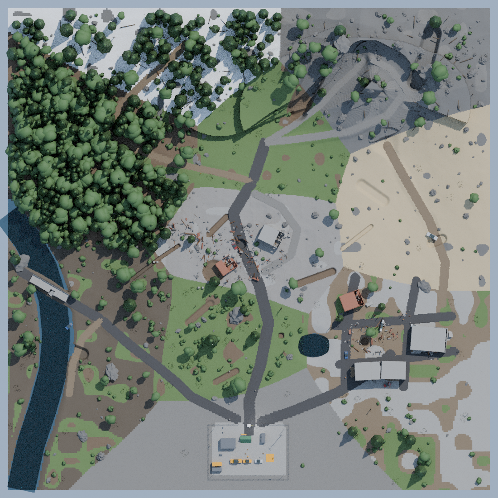
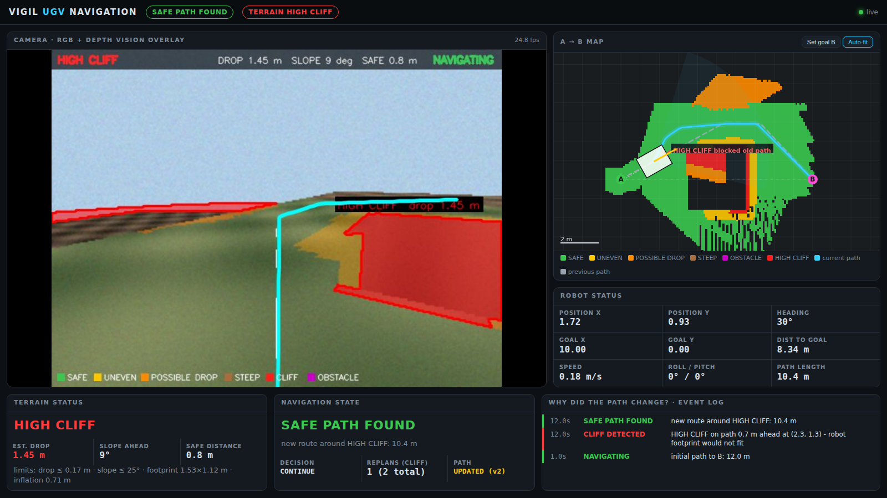
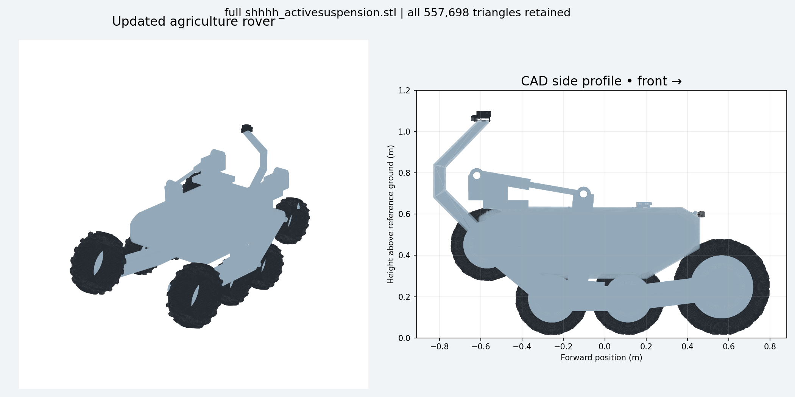

# VIGIL Multi-Purpose UGV — simulation

**VIGIL** is an eight-wheel rover (twin rockers, independently sprung wheels) designed for more than
one job. This repository holds its **ROS 2 Jazzy / Gazebo Harmonic** simulations. There are three
separate environments, each showing a different use, and a small menu program that starts one of them.

| # | Environment | What the rover does there | Folder |
|---|---|---|---|
| 1 | **Military search and rescue** | Drives across a disaster area, then searches for people with a thermal camera | [`military_world/`](military_world) |
| 2 | **Agriculture** | Drives crop rows in a cotton farm; SLAM, Nav2, lighting, active suspension | [`ros2_ws/`](ros2_ws) |
| 3 | **Rock terrain** | Detects cliffs with the depth camera, replans around them, climbs hills; 8-wheel vs 4-wheel comparison | [`vigil_rough_terrain_ws/`](vigil_rough_terrain_ws) |
| — | **Launcher** | A menu that starts one of the three | [`vigil/`](vigil) |

The three projects are **independent**. Each has its own ROS packages, world, robot model,
controllers, parameters, dashboard and `ROS_DOMAIN_ID`, and each is built on its own. They share
no code, and only one runs at a time.

<p align="center">
  
  
  
</p>
<p align="center"><sub>Left: the military SAR world (top view). Middle: the rock-terrain navigation dashboard
while it replans around a cliff. Right: the VIGIL rover model used in the simulations.</sub></p>

---

## Contents

1. [Project status — what is done and what is not](#1-project-status--what-is-done-and-what-is-not)
2. [Repository structure](#2-repository-structure)
3. [Install on your computer](#3-install-on-your-computer)
4. [Build](#4-build)
5. [Run](#5-run)
6. [What you should see (expected output)](#6-what-you-should-see-expected-output)
7. [How to operate each environment](#7-how-to-operate-each-environment)
8. [Where to change things](#8-where-to-change-things)
9. [Tests](#9-tests)
10. [Troubleshooting](#10-troubleshooting)

---

## 1. Project status — what is done and what is not

*Last updated: 24 September 2026.* This is a **simulation-only** project. No real hardware is
controlled. "Verified in Gazebo" means the result was measured in the running simulator.
"Offline" means it was checked by Python tests without Gazebo.

### Military search and rescue — `military_world/`

| Status | Item |
|---|---|
| ✅ Done | 300 × 300 m disaster world, built in Blender and exported to Gazebo: roads, buildings, rubble, vehicles, a river, a forest, 20 walking people, and casualties inside and outside buildings |
| ✅ Done | Rover in the world: 4K RGB camera, depth camera, segmentation camera, thermal camera (320 × 240), LiDAR, IMU |
| ✅ Done | Thermal human detection (temperature band, contrast, size and shape filters, 4-frame confirmation). Each person gets a permanent ID (H1, H2, …) and a map marker |
| ✅ Done | A→B navigation: depth-camera terrain and cliff map, footprint-aware A*, replanning, hill climbing. It never stops for good: it turns, replans or reverses instead |
| ✅ Done | SAR mission: 10 search points around B, thermal scans of building faces, and a `SAR COMPLETE` report. Tested offline, including a full simulated mission |
| ✅ Done | Web control-station dashboard (http://localhost:8080) |
| ✅ Verified in Gazebo | Smooth driving: 3.0 m/s top speed, jerk-limited acceleration of about 1 m/s², no wheelie. Motion tests 16/16 passed. Flat road, slope, steep hill, obstacle and cliff scenarios passed |
| ✅ Verified | World scale is 1 unit = 1 m (`scale_check.py`). Operational zone is 170 × 170 m |
| ✅ Fixed | Gazebo thermal-camera crash on start-up |
| 🟡 In progress | **Simulation speed.** The full world ran at only ~6.5 % of real time. The cause was measured: ~3,100 collision shapes plus the walkers' collisions. The fix (24 Sep) keeps only the 955 shapes the rover can reach. **Its effect on real-time speed has not been measured yet.** |
| ⬜ Not done | A full SAR mission in the big urban area (`test_motion.sh --urban`), run to the end in Gazebo |
| ⬜ Not done | SLAM. The rover's position comes from the simulator's ground truth |
| ⬜ Known gap | One baseline person (`SAR_StaticPerson_001`) is missing from the exported world. Re-export from Blender to restore it |

### Agriculture — `ros2_ws/`

| Status | Item |
|---|---|
| ✅ Done | All 12 build stages exist: environment, robot, world and sensors, visualisation, odometry (EKF), 3D SLAM (RTAB-Map), traversability, Nav2 navigation, exploration and return, lighting, suspension, integrated run |
| ✅ Verified in Gazebo | Short integrated demo: curved drive, Dijkstra return (0.216 m error), day/night lighting, all three suspension modes |
| 🟡 Partial | Crop-row mission (serpentine sweep with U-turns). Partial sweeps work, but **no full 23-row run has passed**. Tractor contact and row drift were seen |
| ⬜ Not done | Validated obstacle avoidance (the collision-monitor inputs are off) and full-field exploration to completion |
| ⬜ Provisional | Rover mass (286 kg) and inertia, and the rocker pivots, are inferred from an STL without joints; this is not an exact CAD twin |

Details: [`ros2_ws/ACCEPTANCE.md`](ros2_ws/ACCEPTANCE.md).

### Rock terrain — `vigil_rough_terrain_ws/`

| Status | Item |
|---|---|
| ✅ Done | 18 × 18 m rocky terrain; eight sprung wheels plus two rockers, all simulated by the physics engine (no scripted poses) |
| ✅ Verified in Gazebo | 8-wheel vs 4-wheel comparison: the **8-wheel rover reached B** (27.7 s simulated); the 4-wheel rover got stuck (it did not flip) |
| ✅ Done | Depth-camera cliff detection, A* replanning, dashboard, and 13 test worlds (cliffs, slopes, narrow routes, no route, …); offline closed-loop tests pass |
| ⬜ Not done | Nav2 on this terrain, validated contact data, and a proof that the rover can cross any terrain (earlier long routes exceeded the 38° tilt limit) |

Details: [`VALIDATION.md`](vigil_rough_terrain_ws/src/vigil_rough_terrain/docs/VALIDATION.md),
[`VISION_NAVIGATION.md`](vigil_rough_terrain_ws/src/vigil_rough_terrain/docs/VISION_NAVIGATION.md).

### Launcher — `vigil/`

✅ Done and in use: a menu that starts one project at a time, sources only that project's
workspace, and stops any leftovers from the other projects before starting.

### Next steps

1. Measure the SAR world's real-time speed after the collision fix. Run the full urban SAR mission.
2. Agriculture: complete a 23-row run, then turn obstacle avoidance back on and validate it.
3. Add a licence file. Until then, all rights are reserved by the authors.

---

## 2. Repository structure

```
vigil-multi-purpose-ugv/
├── README.md                          this file
│
├── vigil/                             LAUNCHER (no robot code)
│   ├── setup_vigil.sh                 one-time: installs the `vigil` command
│   ├── vigil                          the command itself
│   ├── master_launcher/vigil_launcher.py   the menu
│   └── publish_to_github.sh           (maintainer) uploads the projects to this repository
│
├── military_world/                    1. MILITARY SEARCH AND RESCUE
│   ├── military_world.blend           the world in Blender (source)
│   ├── export_gazebo.py               Blender → Gazebo exporter
│   ├── gazebo_export/                 exported world: military_world.sdf + meshes/
│   ├── plugins/WaypointSystem.cc      Gazebo plugin that walks the people along their routes
│   ├── CMakeLists.txt                 builds that plugin into military_world/build/
│   ├── run_gazebo.sh                  opens the world alone (no rover)
│   ├── sar_*.json / .csv              building footprints, people, routes, heat table
│   ├── preview_*.png                  world pictures
│   └── sar_ws/                        ROS 2 WORKSPACE for the rover in this world
│       ├── README.md                  full details (mission, topics, parameters, crash notes)
│       ├── stop_sar.sh                stops anything left running
│       ├── test_motion.sh             Gazebo acceptance tests
│       ├── measure_physics.sh / measure_speed.sh   simulation-speed diagnosis
│       └── src/vigil_sar/
│           ├── config/sar_mission.yaml    ALL mission / world / sensor parameters
│           ├── config/physics.yaml        gravity, time step, drive limits, rover mass
│           ├── launch/                    sar_mission (all-in-one), sim, navigation, sar, dashboard
│           ├── scripts/                   ROS nodes + their logic (planner, drive, thermal, SAR, world builder)
│           ├── urdf/  meshes/             rover model
│           ├── dashboard/index.html       web control station
│           └── test/                      offline tests (no Gazebo needed)
│
├── ros2_ws/                           2. AGRICULTURE
│   ├── run.sh  stop.sh  demo.sh       build + start, stop, scripted demo
│   ├── README.md  ACCEPTANCE.md  HACKATHON.md  CAD_UPDATE.md
│   ├── src/agri_ugv/                  launch, config (Nav2, EKF, SLAM), scripts, farm world
│   ├── src/agri_ugv_description/      rover URDF + meshes
│   ├── src/agri_ugv_setup/            environment check
│   ├── tools/  tests/                 live checks and unit tests
│   └── reports/                       recorded results and pictures
│
└── vigil_rough_terrain_ws/            3. ROCK TERRAIN
    ├── README.md
    └── src/vigil_rough_terrain/
        ├── config/vision_nav.yaml     A, B, speeds, cliff/slope thresholds
        ├── launch/                    vision_nav (main), terrain_sim, comparison
        ├── worlds/rock_terrain.sdf + worlds/test/   main world + 13 test worlds
        ├── models/rocky_terrain_n4/   terrain meshes and textures
        ├── scripts/  urdf/  meshes/  dashboard/
        ├── test/                      offline closed-loop tests
        └── docs/                      VALIDATION.md, VISION_NAVIGATION.md, results
```

Not in the repository, because they are created on your computer: every `build/`, `install/`
and `log/` folder, `military_world/sar_ws/generated/` (the SAR world is rebuilt at every launch),
and `diagnosis/` (test logs).

---

## 3. Install on your computer

**You need:** Ubuntu 24.04, ROS 2 **Jazzy** and Gazebo **Harmonic**. A dedicated GPU is strongly
recommended, because the SAR world is large. Keep several GB of disk free: the agriculture SLAM
maps grow, and its disk guard stops the run below 1 GB free.

```bash
# 1. ROS 2 Jazzy desktop: follow https://docs.ros.org/en/jazzy/Installation/Ubuntu-Install-Debs.html
#    Gazebo Harmonic comes with ros-jazzy-ros-gz (https://gazebosim.org/docs/harmonic/ros_installation/)

# 2. Tools and libraries used by the three projects
sudo apt update
sudo apt install -y git cmake g++ python3-colcon-common-extensions python3-rosdep \
  ros-jazzy-ros-gz ros-jazzy-gz-ros2-control ros-jazzy-ros2-controllers ros-jazzy-xacro \
  ros-jazzy-teleop-twist-keyboard python3-numpy python3-opencv python3-yaml

# 3. Get the code
git clone https://github.com/VIGIL-MULTI-PURPOSE-ROBOT/vigil-multi-purpose-ugv.git
cd vigil-multi-purpose-ugv

# 4. Everything else the packages declare (Nav2, RTAB-Map, robot_localization, ...)
sudo rosdep init 2>/dev/null; rosdep update
source /opt/ros/jazzy/setup.bash
rosdep install --from-paths ros2_ws/src vigil_rough_terrain_ws/src military_world/sar_ws/src \
  --ignore-src -r -y --rosdistro jazzy
```

Every command below starts from the repository folder (`vigil-multi-purpose-ugv/`).

---

## 4. Build

Build each project **in its own fresh terminal**, so one workspace is never built on top of another.

```bash
# 1. Military SAR: the rover workspace ...
cd military_world/sar_ws
source /opt/ros/jazzy/setup.bash
colcon build --symlink-install --packages-select vigil_sar --cmake-args -DPython3_EXECUTABLE=/usr/bin/python3
# ... and the walking-people plugin (once)
cd ..                                   # military_world/
cmake -S . -B build -DCMAKE_BUILD_TYPE=Release && cmake --build build --target sar-waypoint-system -j2
```

```bash
# 2. Agriculture (run.sh also rebuilds by itself every time it starts)
cd ros2_ws
source /opt/ros/jazzy/setup.bash
colcon build --symlink-install
```

```bash
# 3. Rock terrain
cd vigil_rough_terrain_ws
source /opt/ros/jazzy/setup.bash
colcon build --symlink-install --packages-select vigil_rough_terrain --cmake-args -DPython3_EXECUTABLE=/usr/bin/python3
```

A successful build ends with `Summary: N packages finished`. If the plugin's `cmake` step says
`gz-sim8 not found`, install `libgz-sim8-dev` from the
[Gazebo apt repository](https://gazebosim.org/docs/harmonic/install_ubuntu/). Without the plugin
the SAR world still runs, but the people stand still.

---

## 5. Run

### Option A — the launcher menu (easiest)

```bash
bash vigil/setup_vigil.sh                     # once: installs the `vigil` command
echo 'export PATH="$HOME/.local/bin:$PATH"' >> ~/.bashrc && source ~/.bashrc   # once, if it asks
vigil
```

```
=============================================
          VIGIL SIMULATION LAUNCHER
=============================================

Select Environment:

1. Military Search and Rescue
2. Agriculture
3. Rock Terrain
4. Exit

Select option [1-4]:
```

Type a number. The launcher sources ROS and **only** that project's `install/setup.bash`, then
starts that project's own launch file. **Ctrl+C** stops it and brings the menu back. The launcher
never builds, so do step 4 first.

### Option B — run a project directly

| Environment | Terminal commands | ROS_DOMAIN_ID |
|---|---|---|
| Military SAR | `cd military_world/sar_ws && source /opt/ros/jazzy/setup.bash && source install/setup.bash && export ROS_DOMAIN_ID=72`<br>`ros2 launch vigil_sar sar_mission.launch.py` | 72 |
| Agriculture | `cd ros2_ws && ./run.sh row_mission:=true row_count:=3` | 91 |
| Rock terrain | `cd vigil_rough_terrain_ws && source /opt/ros/jazzy/setup.bash && source install/setup.bash && export ROS_DOMAIN_ID=71`<br>`ros2 launch vigil_rough_terrain vision_nav.launch.py` | 71 |

To stop a project, press Ctrl+C in its terminal. If anything is left over, run
`military_world/sar_ws/stop_sar.sh` (SAR) or `ros2_ws/stop.sh` (agriculture).

> Some of the project READMEs show commands with the author's paths (`~/Documents/...` or
> `/home/user/Documents/...`). Replace these with the folder where you cloned this repository.

---

## 6. What you should see (expected output)

### 1. Military search and rescue

| Where | What appears |
|---|---|
| Terminal | Lines from the world builder, such as `collision shapes: 955 kept; removed ...`, then controller and bridge start-up. Loading the world takes about 30–90 s |
| Gazebo window | The disaster world. The rover spawns at point A (0, −8), facing +Y. People walk along their routes |
| Browser: http://localhost:8080 | The control station: 4K camera view, thermal view with detected people marked, the map with the rover, path, point B and human markers, the mission state, the human list, and `sim NN% of real time` |

**Mission output:** the rover drives to B, and the switch shows `SAR READY`. After you press SAR,
events such as `SEARCH POINT k COMPLETE` and `HUMAN H1 DETECTED` appear. The run ends with
`SAR COMPLETE`, the number of humans found and 10/10 search points. Detected people are also
published on `/sar/humans` (JSON) and `/sar/events`.

**Speed:** the Gazebo "RTF" (bottom right) and the dashboard show how fast the simulation runs
compared with real time. The rover's speed in the world is 3.0 m/s *in simulation time*. Below
100 % RTF, it looks slower on screen. See the status table above.

### 2. Agriculture

- A Gazebo window with the cotton farm and the rover, plus **RViz** with the map, the 3D point
  cloud, costmaps and the planned path. Start-up takes about 30 s.
- With `row_mission:=true`, the rover starts at row 1, drives along the row at about 1.2 m/s and
  makes U-turns at the headlands.
- `./demo.sh` (with `row_mission:=false explore:=false`) runs the presentation demo, then the
  lighting and suspension checks, and prints each result.
- Recorded results are in `ros2_ws/reports/` (JSON and PNG).

### 3. Rock terrain

- A Gazebo window with the 18 × 18 m rocky terrain and the rover at A (−5.4, −3.6).
- The dashboard at http://localhost:8080 (middle picture above). It shows the camera with coloured
  terrain classes (safe, uneven, possible drop, steep, cliff, obstacle), the A→B map with the
  current and previous paths, the robot's status, and an event log explaining every replan
  (for example `CLIFF DETECTED → SAFE PATH FOUND`).
- With `comparison.launch.py`, two rovers drive the same course. The result is written to
  `/tmp/vigil-comparison.json`.

---

## 7. How to operate each environment

### Military search and rescue (dashboard)

1. Click **SET GOAL B**, then click on the map. The default B is (80, 40) on Urban Street D.
2. Press **START A→B**. The rover plans a path and drives it, replanning around cliffs and obstacles.
3. When it arrives, the switch shows `SAR READY`. Press **SAR** to start the search. You can also
   press SAR at any time while it is driving.
4. Watch the human list and the map markers. Press SAR again to stop the search.

The same actions from a terminal (after sourcing and setting `ROS_DOMAIN_ID=72`):

```bash
ros2 topic pub --once /navigation/goal geometry_msgs/PoseStamped "{header: {frame_id: world}, pose: {position: {x: 80.0, y: 40.0}}}"
ros2 topic pub --once /navigation/command std_msgs/String "data: START"
ros2 topic pub --once /sar/command std_msgs/String "data: START"      # STOP = off
ros2 topic echo /sar/events
```

Useful launch options: `gui:=false` (no Gazebo window), `goal_x:=80 goal_y:=40` (preset B).

### Agriculture

```bash
cd ros2_ws
./run.sh row_mission:=true row_count:=23           # full row mission (use 3 for a short one)
./run.sh row_mission:=false explore:=false          # demo mode, then in a 2nd terminal:
./demo.sh                                           # scripted demo   (./demo.sh start = exploration)
./run.sh headless:=true rviz:=false                 # no windows
./run.sh stage:=8                                   # start only up to stage N (1-12), see ros2_ws/README.md
./stop.sh
```

### Rock terrain

```bash
ros2 launch vigil_rough_terrain vision_nav.launch.py                        # A→B with cliff detection
ros2 launch vigil_rough_terrain vision_nav.launch.py scenario:=cliff_front  # a test world from worlds/test/
#   e.g. flat small_rocks moderate_slope small_drop cliff_front cliff_left cliff_right
#        narrow_route too_narrow no_route   (an unknown name prints the full list)
ros2 launch vigil_rough_terrain comparison.launch.py                        # 8-wheel vs 4-wheel
ros2 launch vigil_rough_terrain terrain_sim.launch.py                       # rover only; drive it with the
ros2 run teleop_twist_keyboard teleop_twist_keyboard                        #   keyboard (2nd terminal, ROS_DOMAIN_ID=71)
```

On the dashboard, click **Set goal B** and then a point on the map to send the rover somewhere else.

---

## 8. Where to change things

| You want to change | File |
|---|---|
| SAR: start/goal, operational zone, speeds, sensors, search pattern, thermal thresholds, people | `military_world/sar_ws/src/vigil_sar/config/sar_mission.yaml` |
| SAR: gravity, physics step, acceleration/jerk limits, wheel torque, rover mass | `military_world/sar_ws/src/vigil_sar/config/physics.yaml` |
| SAR: the world itself (buildings, people, props) | `military_world/military_world.blend`, then `bash military_world/run_gazebo.sh --reexport` (needs Blender) |
| Agriculture: navigation, EKF, SLAM, sensors | `ros2_ws/src/agri_ugv/config/*.yaml` |
| Rock terrain: A, B, speed, cliff / slope limits, rover footprint | `vigil_rough_terrain_ws/src/vigil_rough_terrain/config/vision_nav.yaml` |
| Launcher menu: project paths, domain IDs | `vigil/master_launcher/vigil_launcher.py` (`PROJECTS`) |

The builds use `--symlink-install`, so changes to Python and YAML files take effect at the next
launch without rebuilding. New files, and changes to `CMakeLists.txt` or `package.xml`, need `colcon build` again.

---

## 9. Tests

| Project | Command | Needs Gazebo? |
|---|---|---|
| Military SAR | `cd military_world/sar_ws/src/vigil_sar && python3 test/test_sar_offline.py` | no (~8 min) |
| Military SAR | `cd military_world/sar_ws && bash test_motion.sh` (`--scenarios`, `--urban`, `--validate`) | yes; log in `diagnosis/test_motion.log` |
| Military SAR | `cd military_world/sar_ws && bash measure_physics.sh` (simulation-speed diagnosis) | yes |
| Agriculture | `cd ros2_ws && python3 -m pytest -q tests && python3 tools/check_structure.py` | no |
| Rock terrain | `cd vigil_rough_terrain_ws && python3 src/vigil_rough_terrain/test/closed_loop_sim.py` | no (~4 min) |
| Rock terrain | `colcon test --packages-select vigil_rough_terrain && colcon test-result --verbose` | no |

---

## 10. Troubleshooting

| Problem | Fix |
|---|---|
| `vigil: command not found` | `echo 'export PATH="$HOME/.local/bin:$PATH"' >> ~/.bashrc && source ~/.bashrc` |
| Launcher says "workspace is not built" | Do the build for that project (section 4) |
| Everything moves in slow motion | The simulation is running below real time; check RTF in Gazebo. Close other heavy programs and screen recorders. For SAR, run `bash measure_physics.sh` and read `diagnosis/measure_physics.log` |
| SAR people don't walk; log says `libsar-waypoint-system.so missing` | Build the plugin (section 4, Military SAR) |
| Gazebo crashes when the SAR world opens | `cd military_world/sar_ws && bash find_crash.sh` and see the crash section of [`sar_ws/README.md`](military_world/sar_ws/README.md) |
| Two rovers appear / old processes keep running | `military_world/sar_ws/stop_sar.sh` or `ros2_ws/stop.sh`, then start again |
| Agriculture says "already has a simulation running" | Stop the other run with `ros2_ws/stop.sh`; do not delete the lock file |

More detail for each project: [`military_world/sar_ws/README.md`](military_world/sar_ws/README.md),
[`military_world/README.md`](military_world/README.md), [`ros2_ws/README.md`](ros2_ws/README.md),
[`vigil_rough_terrain_ws/README.md`](vigil_rough_terrain_ws/README.md), [`vigil/README.md`](vigil/README.md).
