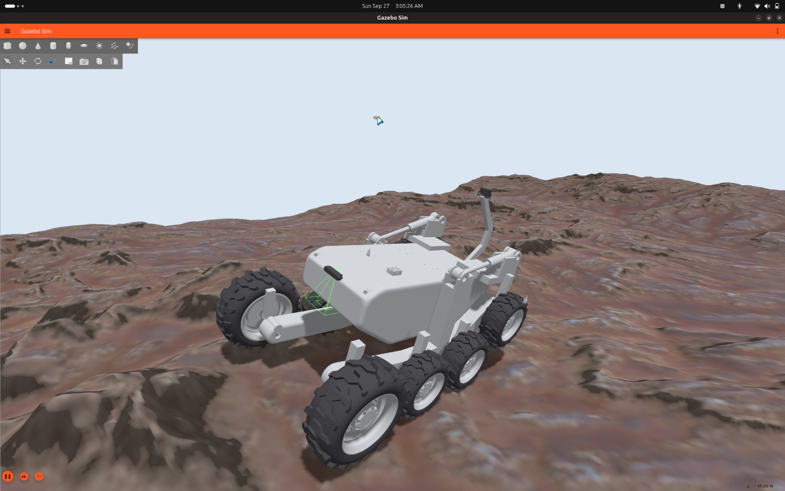
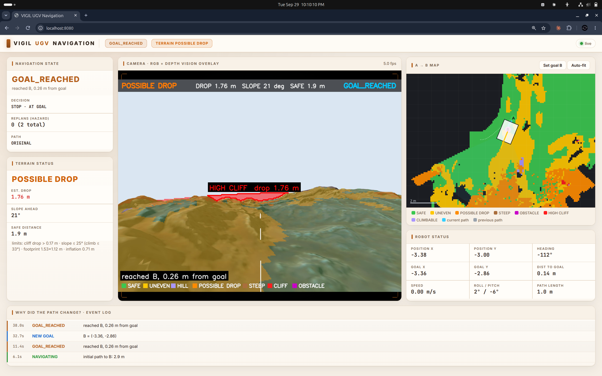

# Rock Terrain

Depth-camera terrain classification, cliff detection and footprint-aware A* navigation on rocky ground.

| Environment | Dashboard |
|---|---|
|  |  |

| What | Where |
|---|---|
| ROS 2 package `vigil_rough_terrain` | [`src/vigil_rough_terrain/`](src/vigil_rough_terrain) |
| Launch files | [`src/vigil_rough_terrain/launch/`](src/vigil_rough_terrain/launch) |
| Worlds and models | [`src/vigil_rough_terrain/worlds/`](src/vigil_rough_terrain/worlds), [`models/`](src/vigil_rough_terrain/models) |
| Dashboard code | [`src/vigil_rough_terrain/dashboard/`](src/vigil_rough_terrain/dashboard) |
| Environment and dashboard images | [`Images/`](Images) |
| Package-level validation notes | [`src/vigil_rough_terrain/docs/`](src/vigil_rough_terrain/docs) |
| Overview, setup and evidence | [`../docs/`](../docs) |

Run: `ros2 launch vigil_rough_terrain vision_nav.launch.py` with `ROS_DOMAIN_ID=71`, then open http://localhost:8080.
Or use VIGIL launcher option 3.
