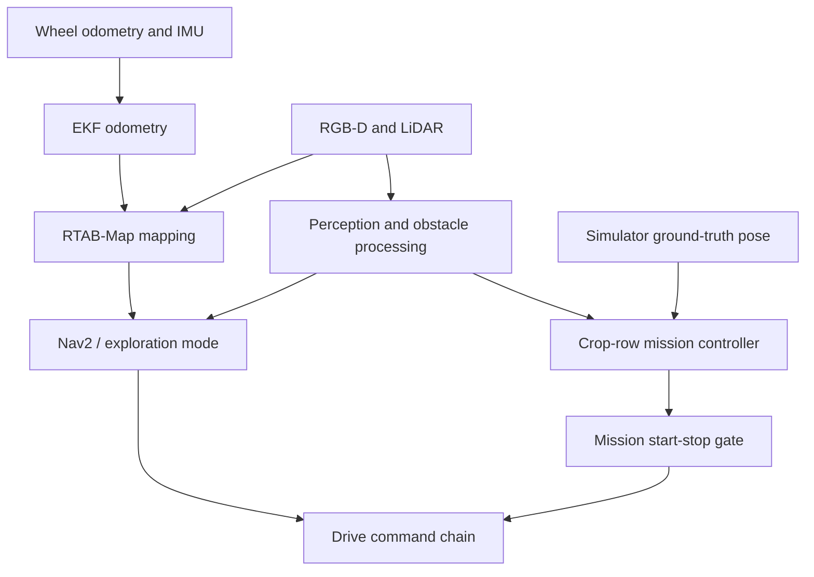

# System architecture

[Project overview](../README.md) · [Operating workflow](navigation-workflow.md)

## Implementation boundaries

VIGIL contains three independent simulation workspaces and an environment launcher. A common rover concept does not imply one common runtime or shared localization implementation. This guide reflects the inspected launch files and subscriptions at source commit `451fe01b1bafb96647134a837b3cb02ab88d0d97`.

## Rough-terrain pipeline

| Stage | Actual input → output | Implementation |
|---|---|---|
| Simulated sensing | World and rover → RGB, depth, camera calibration, ground-truth pose | [Launch](../vigil_rough_terrain_ws/src/vigil_rough_terrain/launch/terrain_sim.launch.py) |
| Terrain interpretation | Depth + calibration + ground-truth pose → terrain classes, slope, roughness, traversability, overlay | [terrain_mapper.py](../vigil_rough_terrain_ws/src/vigil_rough_terrain/scripts/terrain_mapper.py), [terrain_core.py](../vigil_rough_terrain_ws/src/vigil_rough_terrain/scripts/terrain_core.py) |
| Navigation | Terrain grids + ground-truth pose + goal → path, status, `/cmd_vel` | [cliff_navigator.py](../vigil_rough_terrain_ws/src/vigil_rough_terrain/scripts/cliff_navigator.py), [planner_core.py](../vigil_rough_terrain_ws/src/vigil_rough_terrain/scripts/planner_core.py) |
| Wheel control | Linear/angular command → eight-wheel velocity command | [drive.py](../vigil_rough_terrain_ws/src/vigil_rough_terrain/scripts/drive.py) |
| Operator view | Camera overlay, map, pose and navigation state → browser dashboard | [ugv_dashboard.py](../vigil_rough_terrain_ws/src/vigil_rough_terrain/scripts/ugv_dashboard.py) |

The mapper back-projects depth into 3-D and uses the simulator pose to place observations in a world grid. Geometric thresholds classify safe ground, uneven ground, possible drops, steep slopes, obstacles, high cliffs and climbable ground. Footprint-aware A* operates on the resulting costs. This is depth-based perception, not visual pose estimation.

Key interfaces: `/camera/depth_image`, `/camera/camera_info`, `/sim/ground_truth`, `/vision/terrain_classes`, `/vision/slope`, `/vision/roughness`, `/navigation/goal`, `/navigation/path`, `/navigation/status`, `/cmd_vel` and `/wheel_controller/commands`.

RGB and HD RGB supply display imagery. The optional segmentation sensor supplies simulator-generated labels; these should not be presented as predictions from a trained vision model. Thresholds and mission defaults live in [vision_nav.yaml](../vigil_rough_terrain_ws/src/vigil_rough_terrain/config/vision_nav.yaml).

## Agriculture: distinguish mapping from mission control

[Stage-based bringup](../ros2_ws/src/agri_ugv/launch/field.launch.py) enables wheel odometry and EKF from stage 5, RTAB-Map from stage 6, perception from stage 7 and navigation from stage 8. The [SLAM launch](../ros2_ws/src/agri_ugv/launch/slam.launch.py) supplies RGB, depth, LiDAR, IMU and `/odom` to RTAB-Map.

The default row-mission mode starts [crop_row_driver.py](../ros2_ws/src/agri_ugv/scripts/crop_row_driver.py), which subscribes directly to `sim/ground_truth`. It does not become visually localized merely because RTAB-Map is also running. The alternative exploration mode uses a different mission path through Nav2. A visual-only or visual-inertial localization benchmark has not been established by this documentation work.

## Search and rescue

SAR combines a depth-terrain navigation implementation with thermal detection, search waypoints and a web control station. Its navigator also subscribes to `/sim/ground_truth`. The [SAR package guide](../military_world/sar_ws/README.md) documents mission topics, thermal processing and operating controls.

Thermal detection and search behavior are application extensions. They do not replace the core requirement to validate camera-based navigation and localization.

## Mining application mapping

The [proposed mining application](mining.md) uses the rough-terrain pipeline as its foundation: RGB-D observations → geometric terrain grid → footprint-aware planner → wheel control, with dashboard monitoring. The current pose input remains simulator ground truth. A mining-specific world, mission configuration and validation record are not present; this is an application mapping, not a fourth implemented software stack.

## Target architecture and outstanding integration

The intended next step is to feed evaluated visual/visual-inertial pose into the mapper and planner, keeping simulator ground truth as an evaluation reference. This requires frame alignment, timing, covariance, tracking-loss handling and mission-level testing; replacing a topic name alone is insufficient.

Shared perception/navigation packages could eventually replace duplicated scenario code. They are future refactoring work, not a property claimed for the current repository.
