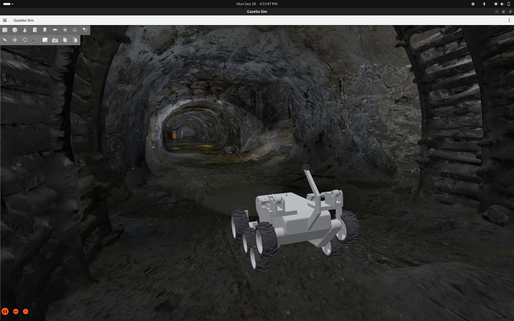
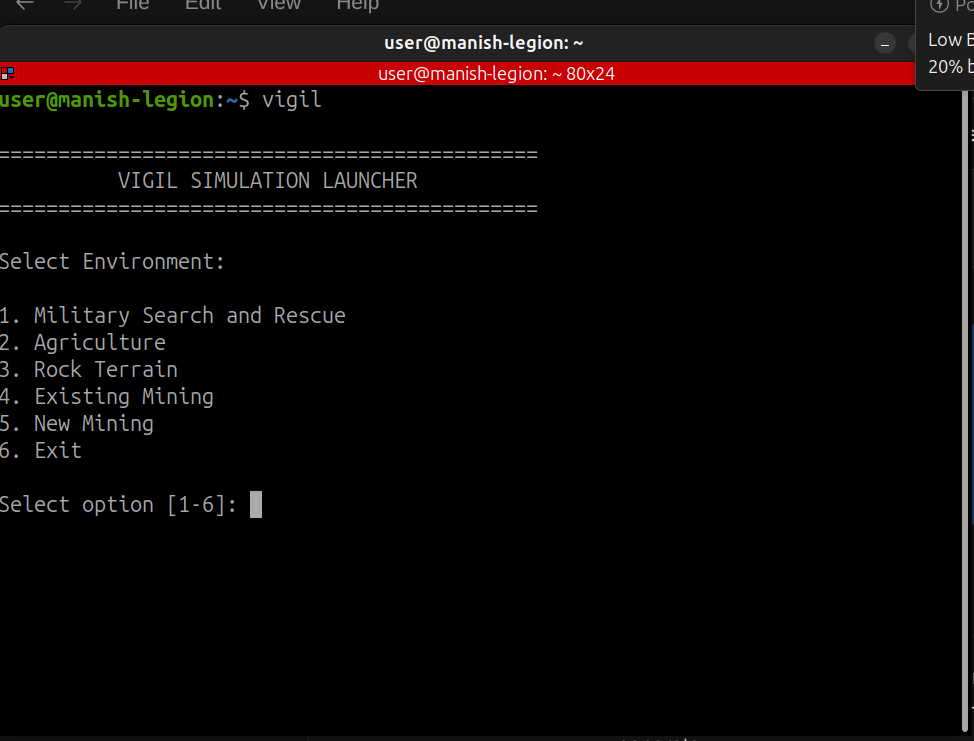
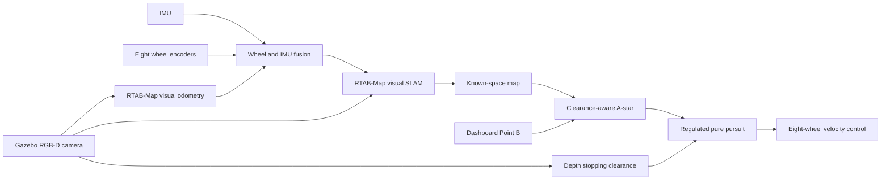

# New Mining environment

The New Mining workspace is an independent Gazebo Harmonic simulation under
[`MINNING/`](../MINNING/). It does not replace or merge with the earlier local
Mining workspace. The master launcher keeps that project at option 4 and exposes
the new environment at option 5.

## Runtime data flow

Point B is accepted only in mapped free space with enough clearance for the
1.56 x 1.12 m rover. The planner inflates obstacles and gas/human exclusion
regions, uses weighted eight-connected A*, collision-checks its shortcuts, and
publishes the preview path. During motion, regulated pure pursuit slows for
curvature and nearby obstacles and rejects commands whose predicted arc leaves
the safe corridor. The dashboard reports route errors instead of commanding a
pose jump or traversing unknown space.

Gas, temperature and humidity are spatial simulation fields published as ROS 2
topics. They use simulator pose only to sample the virtual environment; the
navigation loop uses the visual SLAM map and fused pose.

## Third-party mine asset

The photographed mine is **Old underground mine excavation 06** by
[`archiwum_xyz`](https://sketchfab.com/3d-models/old-underground-mine-excavation-06-d020ab9eb98e416da9fd3ccdf88e43d2).
Sketchfab identifies it as a paid Standard-license, non-downloadable asset. Its
geometry and textures are therefore excluded from this public repository. The
world and material mapping are checked in, while licensed owners install their
local copy by following the asset README.
