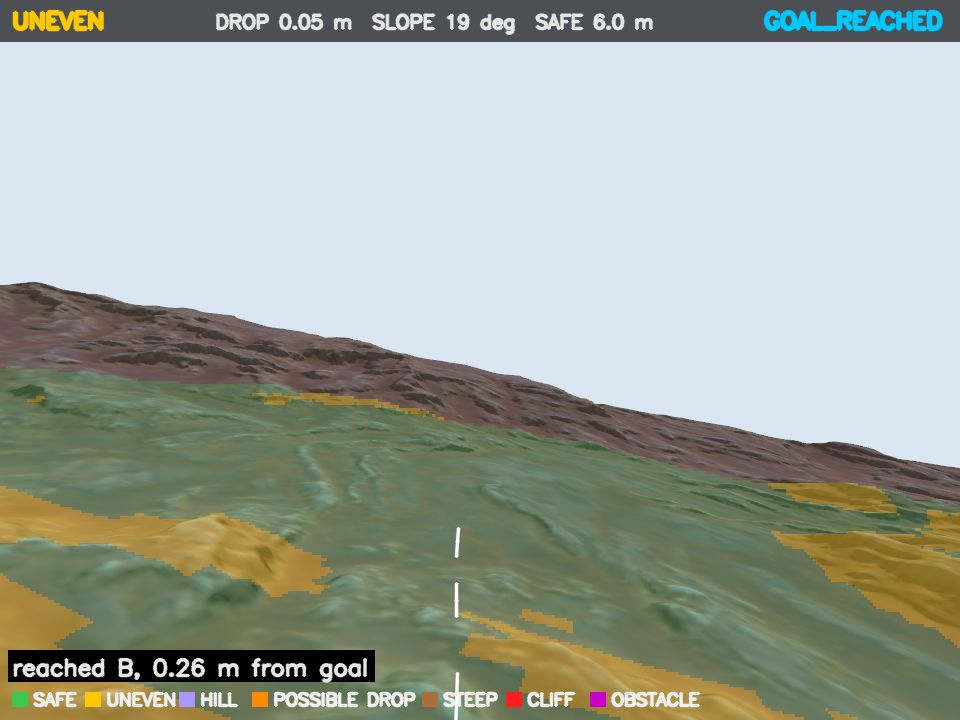

# Simulation evidence and limitations

[Project overview](../README.md) · [Architecture](architecture.md) · [Setup](setup.md)

## Capture session — 27 September 2026

These images were captured from **Gazebo and the running ROS dashboard**, not generated illustrations or mockups. Source commit: `451fe01b1bafb96647134a837b3cb02ab88d0d97`. The documentation changes do not alter the simulation algorithms.

The capture machine already had ROS 2 Jazzy, Gazebo Harmonic and the required rough-terrain runtime dependencies. A fresh clone was built with:

```bash
cd "Rock Terrain"
source /opt/ros/jazzy/setup.bash
colcon build --symlink-install --packages-select vigil_rough_terrain --cmake-args -DPython3_EXECUTABLE=/usr/bin/python3
source install/local_setup.bash
export ROS_DOMAIN_ID=173
```

Result: **1 package finished successfully**. No clean-OS dependency installation or physical-hardware test was performed. Runs used a dedicated ROS domain and Gazebo partition, with the display camera reduced to 960 × 720 at 5 Hz. The depth pipeline retained its original configuration. The dashboard's displayed frame-refresh rate is not an inference-throughput benchmark.

## Default rough-terrain run

```bash
ros2 launch vigil_rough_terrain vision_nav.launch.py cleanup:=false   partition:=vigil_docs_20260927 camera_width:=960 camera_height:=720 camera_rate:=5
```




| Recorded field | Observation |
|---|---|
| Pose source | `/sim/ground_truth` |
| Start | Approximately (−5.40, −3.60) m |
| Goal | (−3.024, −2.160) m |
| Initial planned path | 2.9 m |
| Navigation event | `NAVIGATING` at 6.1 s; `GOAL_REACHED` at 11.4 s simulation time |
| Arrival-event distance | 0.26 m |
| Later sampled distance | 0.15 m; rover speed reported as 0.0 m/s |
| Planning counters at capture | 1 total plan; 0 hazard replans |

[Raw dashboard status](validation/rough-terrain-state.json). The arrival-event distance and the later settled distance are different samples. The 11.4 s value is the event timestamp in simulation time, not wall-clock runtime or a separately measured travel duration.

This establishes one observed goal-reaching run. It does **not** establish visual localization, repeated success rate, collision-free contact, dynamic-obstacle avoidance or physical-world readiness. No independent collision/contact instrumentation was collected during this capture.

## Cliff-scenario observation

```bash
ros2 launch vigil_rough_terrain vision_nav.launch.py scenario:=cliff_front cleanup:=false   partition:=vigil_docs_cliff_20260927 camera_width:=960 camera_height:=720 camera_rate:=5
```


The camera overlay reported `HIGH CLIFF` with an estimated drop of about 1.52 m. The dashboard showed hazard replanning and a goal-arrival state.

**This was not a controlled default-goal trial.** The runtime log records a new goal of approximately (4.41, 3.65) m during the session. The captured state refers to that changed goal. The arrival event says the target was near a hazard and the navigator accepted the closest safe point at 0.95 m; the later sampled distance was 0.59 m. Do not use this capture as a claim that the original cliff-front mission completed at its default goal.

[Full dashboard screenshot](media/cliff-dashboard.png) · [Raw dashboard status](validation/cliff-state.json)

These captures illustrate the actual terrain overlay, map and state reporting. They do not independently verify the controller's “safe point” assessment or collision avoidance.

## Historical records

| Record | Scope |
|---|---|
| [Agriculture acceptance](../Agriculture/ACCEPTANCE.md) | Integrated demo and earlier component measurements; later crop-row failures and limits are explicitly recorded |
| [Rough-terrain mechanical validation](../Rock%20Terrain/src/vigil_rough_terrain/docs/VALIDATION.md) | Specific suspension and eight-wheel/four-wheel comparison conditions |
| [Terrain algorithm history](../Rock%20Terrain/src/vigil_rough_terrain/docs/VISION_NAVIGATION.md) | Offline synthetic-depth tests and subsequent algorithm/configuration revisions |
| [SAR documentation](../Military%20Search%20and%20Rescue/sar_ws/README.md) | Thermal search, navigation and mission operation |
| [Preserved project status](operations.md#1-project-status--what-is-done-and-what-is-not) | Earlier project-wide claims and outstanding work, dated 24 September |

Historical documentation contains superseded configurations and behaviors. Consult the current source/configuration for active thresholds; do not combine measurements from different versions into a single benchmark.

## Capture provenance

The JSON files were saved from the running dashboard's `/state.json`; camera images from `/camera.jpg`; dashboard images from browser screenshots. Captures were taken sequentially, so their exact timestamps and poses need not match. [File hashes](validation/capture-manifest.json) identify the committed media and status snapshots.

The rough-terrain imagery includes “Rocky Terrain n4” by DarkPixel, CC BY 4.0. [Attribution](contributions.md).

